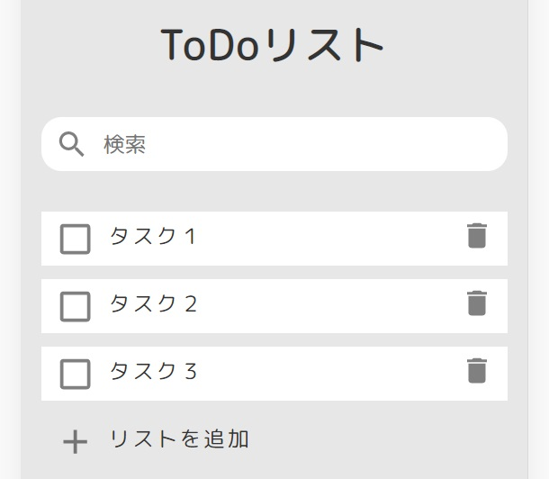

# TODOリスト
 
## アプリケーションの概要
 
vue.jsを使用したTODOリストです。
[デモページ](https://kurosuke-web.com/todo/)

## 画面イメージ ##
 

 
## 機能と環境
 
- TODOタスクのCRUD機能
- ドラッグアンドドロップでタスクの並び替え（vuedraggable）
- 文字検索機能
- ローカルストレージにタスクを保存（vue-ls）
- デモページ環境: Xsever
 
## 必要要件
 
- vue: 2.6.11
- vue-ls: 3.2.1
- vuedraggable: 2.23.2
- jquery: 3.5.1
- babel: 6.23.0
- babelify: 8.0.0
- eslint: 4.12.1
- gulp: 4.0.2
- gulp-eslint: 4.0.0
- gulp-sass: 4.1.0
- webpack: 3.9.1
 
## 使い方
 
1. 「リストを追加」をクリックし、タスクを入力
2. タスクをダブルクリックしてタスクを修正
3. タスク完了時はチェックボックスをクリックし、完了リストに移動
4. タスクをドラッグアンドドロップで並び替え
5. ゴミ箱アイコンをクリックし、タスクを削除
6. 同じブラウザであれば保存されますので、ブラウザを閉じても再度表示されます！
 
## 作者

* 作成者：くろすけ
* Twitter：[@guroguro33](https://twitter.com/guroguro33)
 
## ライセンス
 
"vue-todo" is under [MIT license](https://en.wikipedia.org/wiki/MIT_License).